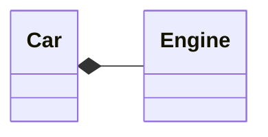
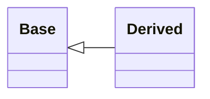
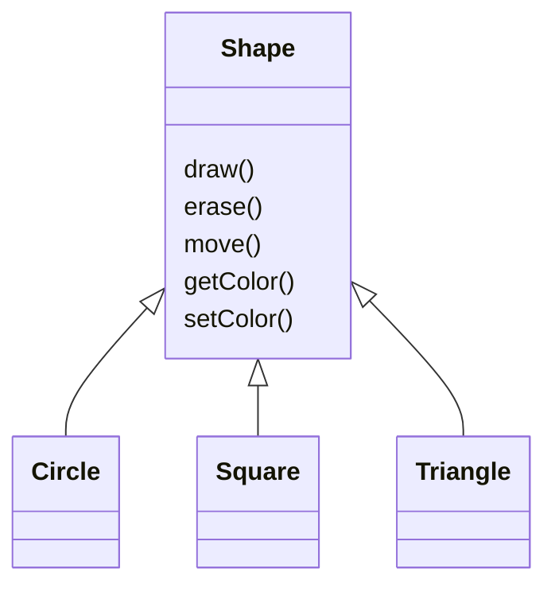
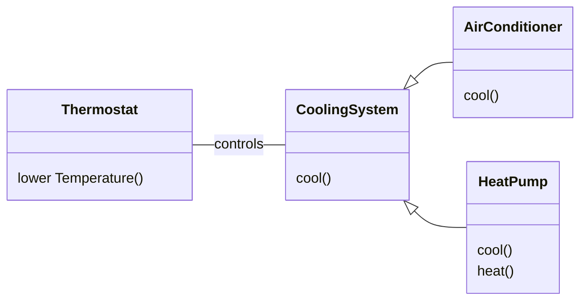

# What is an Object?

## The Hidden Implementation
We can divite into **class creators** (those who create new data types) and **client programmers** (the class consumers who use the data types in their applications).  
- Client programmer: collect a toolbox full of classes to use for rapid application development.
- Class creator: build a class that exposes only what`s necessary to the client programmer and keeps everything else hidden.  

JAVA has three explicity keywords to set the boundaries in a class:  
- *public:* the element is available to everyone.
- *private:* no one can access that element except you, the creator of the type.
- *protected:* like *private*, with the exception that an inheriting class may access *protected* members , but no *private* members.  

## Reusing the Implementation
When you compose a new class from existing classes, this concept is called ***composition*** (if composition is dynamic, it`s usually called ***aggregation***). Composition is often called a ***has-a*** relationship, as in "A cas has an engine".  



The member objects of your new class are typically private, making them inaccessible to *client programmers* who use this class, changes in this members doesn't disturb existing client code. Inheritance doesn't you to change behavior of pragram at runtime, the compiler must place compile-time restrictions on classes created using inheritance.

## Inheritance
Clone a exepecific class and make additions and modifications to the clone, but if the original class is changed, the modified  "clone" also reflects those changes.  



Shape example. The type hierarchy embodies both the similarities and differences between the shapes.



There are two ways to differentiate your new derived class from the original base class.
- Add new methods to the derived class.
    ```mermaid
    classDiagram
    direction TB
    class Shape{
        draw()
        erase()
        move()
        getColor()
        setColor()
    }

    class Triangle {
        FlipVertical()
        FlipHorizontal()
    }

    Shape <|-- Circle
    Shape <|-- Square
    Shape <|-- Triangle
    ```
- Change the behavior of an existing base-class method.
    ```mermaid
    classDiagram
    direction TB
    class Shape{
        draw()
        erase()
        move()
        getColor()
        setColor()
    }

    class Triangle {
        draw()
        erase()
    }

    class Square {
        draw()
        erase()
    }

    class Circle {
        draw()
        erase()
    }
    Shape <|-- Circle
    Shape <|-- Square
    Shape <|-- Triangle
    ```

## Is-a vs. Is-Like-a Relationships
Should inheritance override **only** base-class methods? Derived class should be **exactly** the same type as the base class because it has exactly the same interface. This can be thought of a **pure substitution**, and it's often called the **substitution principle**. This is the ideal way to treat inheritance.  
We can say *"A circle is a shape"*. A test for inheritance is to see if the is-a relationship makes sense for your classes.  
Add new interface elements to a derived type, the new type can still substitute for the base type, this substitution isn't perfect bebause your new methods are not accessible from the base type. This is described as an **is-like-a**. The new type has the interface of the old type but also contains other methods, so you can't say it's exactly the same.  


Is clear that the base class **cooling system** is not general enough, and should be renamend to *"temperature control system"* so it can also include heating.  

## Interchangeable Objects with Polymorphism
In type hierarchies treat an object as its base type, this way you can write code that doesn't depend on specific types. Such code is unaffected by the addition of new types, and this is a common way to extend an OOP program to handle new situations.  
Easily extend a design by deriving new subtipes is one of essential ways to encapsulate chage.  
There's a problem when attempting to treat derived-type objects as their generic base types, the compiler cannot know at compile time precisely what piece of code is executed.