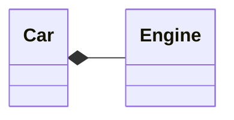

# What is an Object?

## The Hidden Implementation
We can divite into **class creators** (those who create new data types) and **client programmers** (the class consumers who use the data types in their applications).  
- Client programmer: collect a toolbox full of classes to use for rapid application development.
- Class creator: build a class that exposes only what`s necessary to the client programmer and keeps everything else hidden.  

JAVA has three explicity keywords to set the boundaries in a class:  
- *public:* the element is available to everyone.
- *private:* no one can access that element except you, the creator of the type.
- *protected:* like *private*, with the exception that an inheriting class may access *protected* members , but no *private* members.  

## Reusing the Implementation
When you compose a new class from existing classes, this concept is called ***composition*** (if composition is dynamic, it`s usually called ***aggregation***). Composition is often called a ***has-a*** relationship, as in "A cas has an engine".  

The member objects of your new class are typically private, making them inaccessible to *client programmers* who use this class, changes in this members doesn't disturb existing client code. Inheritance doesn't you to change behavior of pragram at runtime, the compiler must place compile-time restrictions on classes created using inheritance.